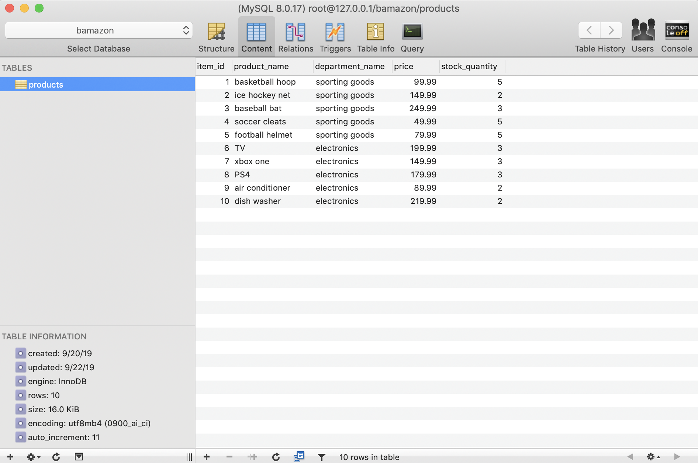
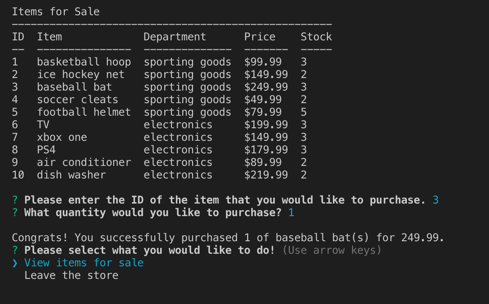

# Bamazon App

# Creator: Drew Pepin
# Created on: September 20th 2019

## Demo 
https://youtu.be/E0k4PolLNss

## About the App
Bamazon pulls data from a mysql database, that stores product information for an online store. The app gives you the option to purchase products from the database after viewing the item list and costs of each product. After choosing which product, you can then choose how much of the product you'd like to buy, and will be given a total cost based on your choices. 

## How to use
- Open the bamazonCustomer.js file in your terminal.
- Follow instructions.

## Sequel Pro database 
Using "Sequel Pro", a product list is kept and updated whenever the application is used. 

## "View Item List" command 
After selecting the "view items list" command, you will be shown the list of available items that is being pulled from the sequel database. 

## Purchasing your products
After choosing which product you want, and how many youd like to buy, you will then purchase the product. You will also be shown the total cost of what you purchased. 

## Technologies used

- javascript 
- nodeJS
- node packages
 - inquirer
 - mysql
 - console.table
- GIT
- GitHub
